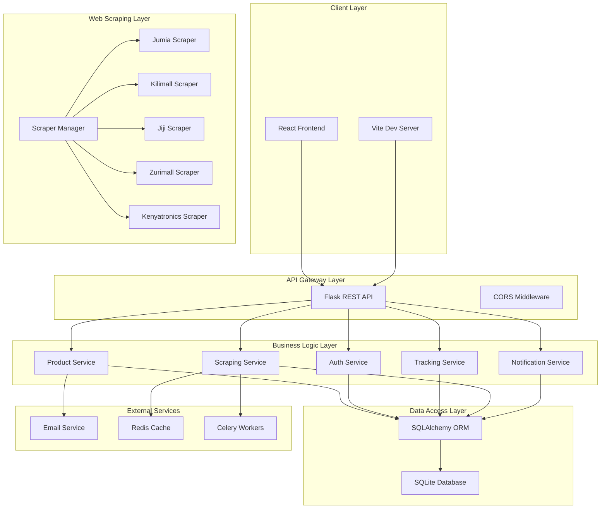
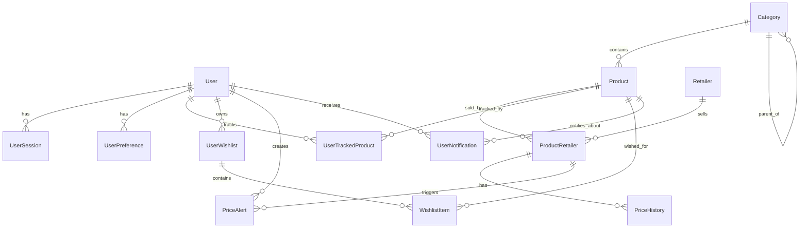
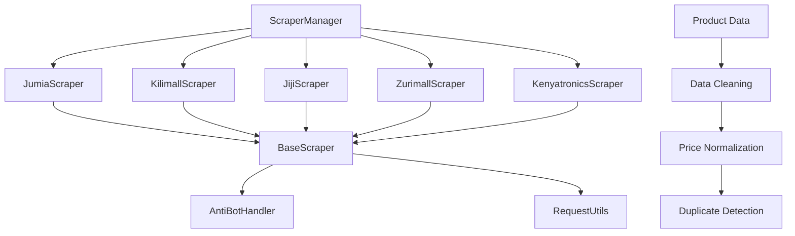
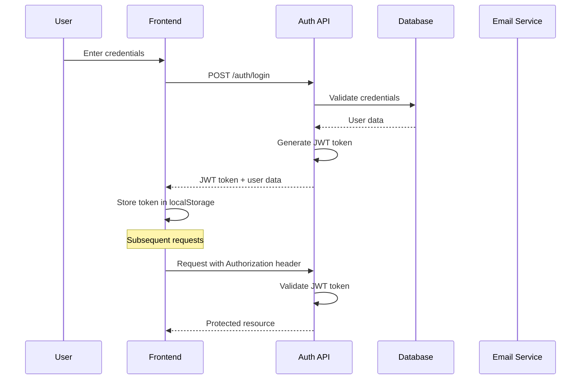
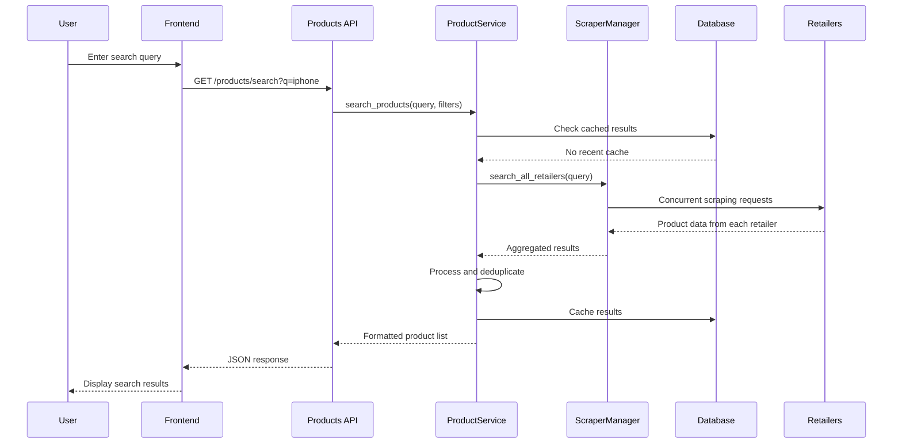
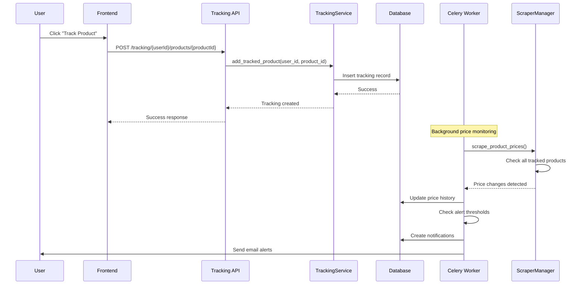
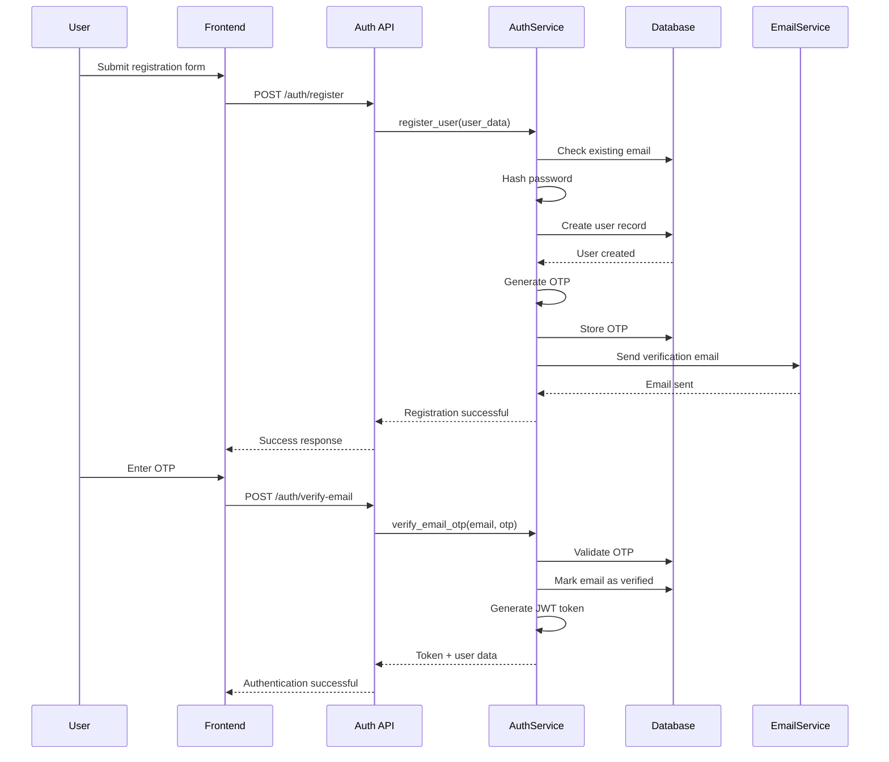

# Thamani: Technical Architecture and Implementation Report

## Executive Summary

Thamani is a comprehensive price tracking and comparison platform designed for Kenyan e-commerce retailers. The system provides real-time price monitoring, product discovery, and intelligent price alerts across multiple retailers including Jumia, Kilimall, Jiji, Zurimall, and Kenyatronics. This report provides a detailed technical analysis of the system's architecture, implementation, and key design decisions.

## Table of Contents

1. [System Overview](#system-overview)
2. [Technology Stack](#technology-stack)
3. [Architecture Design](#architecture-design)
4. [Database Schema](#database-schema)
5. [Backend Architecture](#backend-architecture)
6. [Frontend Architecture](#frontend-architecture)
7. [Web Scraping System](#web-scraping-system)
8. [Authentication & Security](#authentication--security)
9. [API Design](#api-design)
10. [Key Workflows](#key-workflows)
11. [Performance Considerations](#performance-considerations)
12. [Testing Strategy](#testing-strategy)
13. [Deployment & DevOps](#deployment--devops)
14. [Future Enhancements](#future-enhancements)

## System Overview

Thamani operates as a full-stack web application with the following core capabilities:

- **Product Discovery**: Multi-retailer search with intelligent filtering
- **Price Tracking**: Real-time price monitoring with customizable alerts
- **Price Comparison**: Cross-retailer price analysis and deal identification
- **User Management**: Authentication, preferences, and notification management
- **Wishlist Management**: Product saving and organization
- **Real-time Notifications**: Email and push notifications for price changes

### System Architecture Diagram



## Technology Stack

### Backend Technologies

| Component | Technology | Version | Purpose |
|-----------|------------|---------|---------|
| **Web Framework** | Flask | 2.x | REST API development |
| **ORM** | SQLAlchemy | Latest | Database abstraction |
| **Database** | SQLite | 3.x | Data persistence |
| **Authentication** | Flask-JWT-Extended | Latest | Token-based auth |
| **Password Hashing** | Flask-Bcrypt | Latest | Secure password storage |
| **Email Service** | Flask-Mail | Latest | Email notifications |
| **Web Scraping** | BeautifulSoup4, Selenium | 4.13.4, 4.15.2 | Data extraction |
| **Task Queue** | Celery | 5.3.4 | Background processing |
| **Cache** | Redis | 5.0.1 | Data caching |
| **CORS** | Flask-CORS | Latest | Cross-origin requests |

### Frontend Technologies

| Component | Technology | Version | Purpose |
|-----------|------------|---------|---------|
| **Framework** | React | 19.0.0 | UI development |
| **Build Tool** | Vite | 6.3.1 | Development server |
| **Routing** | React Router | 7.5.3 | Client-side routing |
| **Styling** | Tailwind CSS | 4.1.5 | Utility-first CSS |
| **UI Components** | Radix UI | Latest | Accessible components |
| **HTTP Client** | Axios | 1.9.0 | API communication |
| **Animations** | Framer Motion | 12.9.4 | Smooth transitions |
| **Notifications** | React Hot Toast | 2.5.2 | User feedback |

### Development Tools

| Tool | Purpose |
|------|---------|
| **ESLint** | Code linting |
| **Prettier** | Code formatting |
| **Flask-Migrate** | Database migrations |
| **Undetected ChromeDriver** | Anti-bot detection |

## Architecture Design

### Design Patterns

The system implements several architectural patterns:

#### 1. **Service Layer Pattern**
```python
# Example from product_service.py
class ProductService:
    @staticmethod
    def search_products(query, filters=None):
        # Business logic implementation
        pass
    
    @staticmethod
    def get_product_details(product_id):
        # Data access and processing
        pass
```

#### 2. **Repository Pattern**
```python
# Data access abstraction
class ProductRepository:
    @staticmethod
    def find_by_id(product_id):
        return Product.query.get(product_id)
    
    @staticmethod
    def find_by_category(category_id):
        return Product.query.filter_by(category_id=category_id).all()
```

#### 3. **Factory Pattern** (Scraper Manager)
```python
# Scraper factory implementation
class ScraperManager:
    def __init__(self):
        self.scrapers = {
            'jumia': JumiaScraper(),
            'kilimall': KilimallScraper(),
            # ... other scrapers
        }
```

### Microservices Considerations

While currently monolithic, the architecture supports future microservices decomposition:

- **API Gateway**: Flask blueprints provide natural service boundaries
- **Service Discovery**: Blueprint registration pattern
- **Configuration Management**: Environment-based configuration
- **Database Isolation**: Schema-based multi-tenancy ready

## Database Schema

### Core Entities



### Key Tables

#### Users Table
```sql
CREATE TABLE users (
    user_id VARCHAR(36) PRIMARY KEY,
    email VARCHAR(255) UNIQUE NOT NULL,
    password_hash VARCHAR(255) NOT NULL,
    username VARCHAR(50) UNIQUE,
    full_name VARCHAR(255),
    created_at TIMESTAMP DEFAULT CURRENT_TIMESTAMP,
    updated_at TIMESTAMP,
    last_login_at TIMESTAMP,
    account_status VARCHAR(20) DEFAULT 'active',
    profile_image_url VARCHAR(255),
    email_verified BOOLEAN DEFAULT FALSE
);
```

#### Products Table
```sql
CREATE TABLE products (
    product_id INTEGER PRIMARY KEY AUTOINCREMENT,
    name VARCHAR(255) NOT NULL,
    description TEXT,
    category_id INTEGER,
    brand VARCHAR(100),
    model VARCHAR(100),
    image_url VARCHAR(255),
    specifications TEXT,
    created_at TIMESTAMP DEFAULT CURRENT_TIMESTAMP,
    updated_at TIMESTAMP
);
```

#### Product Retailers Table
```sql
CREATE TABLE product_retailers (
    product_retailer_id INTEGER PRIMARY KEY AUTOINCREMENT,
    product_id INTEGER NOT NULL,
    retailer_id INTEGER NOT NULL,
    retailer_product_url VARCHAR(512) NOT NULL,
    retailer_product_id VARCHAR(100),
    current_price DECIMAL(10,2) NOT NULL,
    currency_code VARCHAR(3) DEFAULT 'KES',
    last_updated TIMESTAMP DEFAULT CURRENT_TIMESTAMP,
    in_stock BOOLEAN DEFAULT TRUE,
    last_scrape_attempt TIMESTAMP,
    scraping_error TEXT,
    scrape_count INTEGER DEFAULT 0,
    is_scrapable BOOLEAN DEFAULT TRUE,
    FOREIGN KEY (product_id) REFERENCES products(product_id),
    FOREIGN KEY (retailer_id) REFERENCES retailers(retailer_id),
    UNIQUE(product_id, retailer_id)
);
```

## Backend Architecture

### Flask Application Structure

```
backend/
├── app/
│   ├── __init__.py          # Application factory
│   ├── config/
│   │   └── app_config.py    # Configuration management
│   ├── extensions/
│   │   └── extensions.py    # Flask extensions setup
│   ├── models/              # SQLAlchemy models
│   │   ├── __init__.py
│   │   ├── user.py
│   │   ├── product.py
│   │   └── tracking.py
│   ├── services/            # Business logic layer
│   │   ├── auth.py
│   │   ├── product_service.py
│   │   ├── tracking_service.py
│   │   └── scraping_service.py
│   ├── apis/                # REST API endpoints
│   │   ├── auth/
│   │   ├── products/
│   │   ├── tracking/
│   │   └── scraping/
│   ├── scrapers/            # Web scraping modules
│   │   ├── scraper_manager.py
│   │   ├── jumia_scraper.py
│   │   └── kilimall_scraper.py
│   ├── utils/               # Utility functions
│   └── templates/           # Email templates
├── migrations/              # Database migrations
├── instance/                # Instance-specific data
└── requirements.txt
```

### API Blueprint Structure

```python
# Example from apis/products/resource.py
@products.route('/search', methods=['GET'])
def search_products():
    """Search products across retailers"""
    query = request.args.get('q', '')
    category = request.args.get('category')
    min_price = request.args.get('min_price')
    max_price = request.args.get('max_price')
    
    try:
        results = ProductService.search_products(
            query=query,
            filters={
                'category': category,
                'price_range': (min_price, max_price)
            }
        )
        return jsonify(results), 200
    except Exception as e:
        logger.error(f"Search error: {str(e)}")
        return jsonify({'error': 'Search failed'}), 500
```

## Frontend Architecture

### React Component Hierarchy

```
frontend/src/
├── components/
│   ├── auth/                # Authentication components
│   ├── common/              # Reusable UI components
│   ├── dashboard/           # Dashboard layout components
│   ├── home/                # Landing page components
│   ├── products/            # Product-related components
│   ├── settings/            # Settings components
│   └── ui/                  # Base UI components
├── context/                 # React context providers
│   ├── AuthContext.jsx
│   ├── ThemeContext.jsx
│   └── ToastContext.jsx
├── pages/                   # Page components
│   ├── Dashboard.jsx
│   ├── ProductSearch.jsx
│   ├── TrackedProducts.jsx
│   └── Settings.jsx
├── services/                # API service layer
│   ├── api.js
│   ├── auth.js
│   └── products.js
├── utils/                   # Utility functions
└── lib/                     # Library configurations
```

### State Management

The application uses React Context for state management:

```jsx
// AuthContext.jsx
const AuthContext = createContext();

export const AuthProvider = ({ children }) => {
    const [user, setUser] = useState(null);
    const [loading, setLoading] = useState(true);
    
    const login = async (credentials) => {
        try {
            const response = await authService.login(credentials);
            setUser(response.user);
            localStorage.setItem('token', response.token);
        } catch (error) {
            throw new Error('Login failed');
        }
    };
    
    // ... other auth methods
};
```

## Web Scraping System

### Scraper Architecture



### Base Scraper Implementation

```python
class BaseScraper:
    def __init__(self, base_url, retailer_name):
        self.base_url = base_url
        self.retailer_name = retailer_name
        self.session = requests.Session()
        self.setup_session()
    
    def setup_session(self):
        """Configure session with anti-bot measures"""
        self.session.headers.update({
            'User-Agent': self.get_random_user_agent(),
            'Accept': 'text/html,application/xhtml+xml,application/xml;q=0.9,*/*;q=0.8',
            'Accept-Language': 'en-US,en;q=0.5',
            'Accept-Encoding': 'gzip, deflate',
            'Connection': 'keep-alive',
            'Upgrade-Insecure-Requests': '1',
        })
    
    def search_products(self, query, max_pages=2):
        """Abstract method for product search"""
        raise NotImplementedError
    
    def get_product_details(self, url):
        """Abstract method for product details"""
        raise NotImplementedError
```

### Anti-Bot Detection Handling

```python
class AntiBotHandler:
    @staticmethod
    def get_random_user_agent():
        """Rotate user agents to avoid detection"""
        user_agents = [
            'Mozilla/5.0 (Windows NT 10.0; Win64; x64) AppleWebKit/537.36',
            'Mozilla/5.0 (Macintosh; Intel Mac OS X 10_15_7) AppleWebKit/537.36',
            # ... more user agents
        ]
        return random.choice(user_agents)
    
    @staticmethod
    def add_random_delay(min_delay=1, max_delay=3):
        """Add random delays between requests"""
        time.sleep(random.uniform(min_delay, max_delay))
```

## Authentication & Security

### JWT-Based Authentication Flow



### Security Measures

1. **Password Security**
   - Bcrypt hashing with salt
   - Minimum password requirements
   - Account lockout after failed attempts

2. **JWT Security**
   - Short-lived access tokens (24 hours)
   - Secure token storage in httpOnly cookies
   - Token refresh mechanism

3. **API Security**
   - CORS configuration
   - Rate limiting
   - Input validation and sanitization

4. **Data Protection**
   - SQL injection prevention via ORM
   - XSS protection via input sanitization
   - CSRF protection

## API Design

### RESTful API Structure

```
API Base: /api/v1

Authentication:
POST   /auth/login
POST   /auth/register
POST   /auth/logout
POST   /auth/refresh
GET    /auth/me

Products:
GET    /products/search?q={query}&category={id}
GET    /products/{id}
GET    /products/categories
GET    /products/retailers
GET    /products/popular

Tracking:
GET    /tracking/{userId}/products
POST   /tracking/{userId}/products/{productId}
PUT    /tracking/{userId}/products/{productId}
DELETE /tracking/{userId}/products/{productId}
GET    /tracking/{userId}/summary

Settings:
GET    /settings/profile
PUT    /settings/profile
PUT    /settings/preferences
PUT    /settings/password
```

### API Response Format

```json
{
    "success": true,
    "data": {
        "products": [...],
        "pagination": {
            "page": 1,
            "limit": 20,
            "total": 150
        }
    },
    "message": "Products retrieved successfully"
}
```

## Key Workflows

### Product Search Workflow



### Price Tracking Workflow



### User Authentication Workflow



## Performance Considerations

### Database Optimization

1. **Indexing Strategy**
```sql
-- Key indexes for performance
CREATE INDEX idx_products_category ON products(category_id);
CREATE INDEX idx_products_brand ON products(brand);
CREATE INDEX idx_product_retailers_product ON product_retailers(product_id);
CREATE INDEX idx_product_retailers_retailer ON product_retailers(retailer_id);
CREATE INDEX idx_price_history_product_retailer ON price_history(product_retailer_id);
CREATE INDEX idx_user_tracked_products_user ON user_tracked_products(user_id);
```

2. **Query Optimization**
```python
# Efficient product search query
def search_products_optimized(query, category_id=None):
    base_query = Product.query
    
    if category_id:
        base_query = base_query.filter_by(category_id=category_id)
    
    # Use ILIKE for case-insensitive search
    if query:
        base_query = base_query.filter(
            Product.name.ilike(f'%{query}%')
        )
    
    return base_query.options(
        # Eager load related data
        joinedload(Product.category),
        joinedload(Product.product_retailers).joinedload(ProductRetailer.retailer)
    ).all()
```

### Caching Strategy

1. **Redis Caching**
```python
# Cache scraped product data
@cache.memoize(timeout=3600)  # 1 hour cache
def get_scraped_products(query):
    return scraper_manager.search_all_retailers(query)

# Cache user preferences
@cache.memoize(timeout=1800)  # 30 minutes
def get_user_preferences(user_id):
    return UserPreference.query.filter_by(user_id=user_id).first()
```

2. **Application-Level Caching**
```python
# In-memory cache for frequently accessed data
from functools import lru_cache
import time

@lru_cache(maxsize=1000)
def get_categories_cache():
    return Category.query.all()

def invalidate_cache():
    get_categories_cache.cache_clear()
```

### Scraping Performance

1. **Concurrent Processing**
```python
# Use ThreadPoolExecutor for parallel scraping
with ThreadPoolExecutor(max_workers=5) as executor:
    futures = [
        executor.submit(scraper.search_products, query)
        for scraper in scrapers
    ]
    results = [future.result() for future in futures]
```

2. **Rate Limiting**
```python
class RateLimiter:
    def __init__(self, requests_per_minute=60):
        self.requests_per_minute = requests_per_minute
        self.requests = []
    
    def can_make_request(self):
        now = time.time()
        # Remove old requests
        self.requests = [req for req in self.requests if now - req < 60]
        return len(self.requests) < self.requests_per_minute
```

## Testing Strategy

### Backend Testing

```python
# tests/test_product_service.py
import pytest
from app.services.product_service import ProductService

class TestProductService:
    def test_search_products_success(self, mock_db):
        # Arrange
        query = "iPhone"
        
        # Act
        results = ProductService.search_products(query)
        
        # Assert
        assert len(results) > 0
        assert all('name' in product for product in results)
    
    def test_search_products_empty_query(self):
        # Should handle empty queries gracefully
        results = ProductService.search_products("")
        assert results == []
```

### Frontend Testing

```jsx
// components/__tests__/ProductCard.test.jsx
import { render, screen } from '@testing-library/react';
import ProductCard from '../ProductCard';

test('renders product information', () => {
    const product = {
        name: 'iPhone 14',
        price: 120000,
        retailer: 'Jumia'
    };
    
    render(<ProductCard product={product} />);
    
    expect(screen.getByText('iPhone 14')).toBeInTheDocument();
    expect(screen.getByText('KES 120,000')).toBeInTheDocument();
});
```

### Integration Testing

```python
# tests/test_api_integration.py
def test_product_search_api(client, auth_headers):
    response = client.get('/products/search?q=iPhone', 
                         headers=auth_headers)
    
    assert response.status_code == 200
    data = response.get_json()
    assert 'products' in data
    assert len(data['products']) > 0
```

## Deployment & DevOps

### Docker Configuration

```dockerfile
# backend/Dockerfile
FROM python:3.11-slim

WORKDIR /app

COPY requirements.txt .
RUN pip install -r requirements.txt

COPY . .

EXPOSE 5000

CMD ["flask", "run", "--host=0.0.0.0"]
```

```dockerfile
# frontend/Dockerfile
FROM node:18-alpine

WORKDIR /app

COPY package*.json .
RUN npm install

COPY . .

RUN npm run build

EXPOSE 3000

CMD ["npm", "run", "preview"]
```

### Docker Compose

```yaml
version: '3.8'

services:
  backend:
    build: ./backend
    ports:
      - "5000:5000"
    environment:
      - DATABASE_URL=postgresql://user:password@db:5432/thamani
    depends_on:
      - db
      - redis

  frontend:
    build: ./frontend
    ports:
      - "3000:3000"
    depends_on:
      - backend

  db:
    image: postgres:15
    environment:
      - POSTGRES_DB=thamani
      - POSTGRES_USER=user
      - POSTGRES_PASSWORD=password
    volumes:
      - postgres_data:/var/lib/postgresql/data

  redis:
    image: redis:7-alpine

volumes:
  postgres_data:
```

### CI/CD Pipeline

```yaml
# .github/workflows/deploy.yml
name: Deploy to Production

on:
  push:
    branches: [main]

jobs:
  test:
    runs-on: ubuntu-latest
    steps:
      - uses: actions/checkout@v3
      - name: Run backend tests
        run: |
          cd backend
          pip install -r requirements.txt
          python -m pytest
      
      - name: Run frontend tests
        run: |
          cd frontend
          npm install
          npm run test

  deploy:
    needs: test
    runs-on: ubuntu-latest
    steps:
      - name: Deploy to production
        run: |
          echo "Deploying to production..."
```

## Future Enhancements

### Phase 1: Performance & Scalability

1. **Database Migration**
   - Migrate from SQLite to PostgreSQL
   - Implement database sharding
   - Add read replicas

2. **Caching Layer**
   - Implement Redis for session storage
   - Add CDN for static assets
   - Cache API responses

3. **Microservices Architecture**
   - Split scraping service
   - Separate notification service
   - API gateway implementation

### Phase 2: Advanced Features

1. **Machine Learning Integration**
   - Price prediction models
   - Product recommendation engine
   - Anomaly detection for price changes

2. **Real-time Features**
   - WebSocket integration
   - Live price updates
   - Real-time notifications

3. **Mobile Application**
   - React Native app
   - Push notifications
   - Offline functionality

### Phase 3: Enterprise Features

1. **Multi-tenancy**
   - Organization accounts
   - Team collaboration
   - Advanced analytics

2. **API Marketplace**
   - Public API access
   - Third-party integrations
   - Webhook support

3. **Advanced Analytics**
   - Price trend analysis
   - Market intelligence
   - Competitor analysis

## Conclusion

Thamani represents a well-architected, scalable solution for price tracking and comparison in the Kenyan e-commerce market. The system's modular design, comprehensive API coverage, and robust scraping infrastructure provide a solid foundation for future growth and feature expansion.

Key strengths include:
- **Scalable Architecture**: Service-oriented design ready for microservices
- **Comprehensive API**: RESTful design with proper error handling
- **Robust Scraping**: Anti-bot detection and concurrent processing
- **Modern Frontend**: React-based UI with excellent UX
- **Security-First**: JWT authentication and data protection
- **Performance Optimized**: Caching, indexing, and efficient queries

The codebase demonstrates strong software engineering practices with proper separation of concerns, comprehensive error handling, and maintainable code structure. Future enhancements should focus on database scalability, real-time features, and machine learning integration to maintain competitive advantage in the price comparison market.
